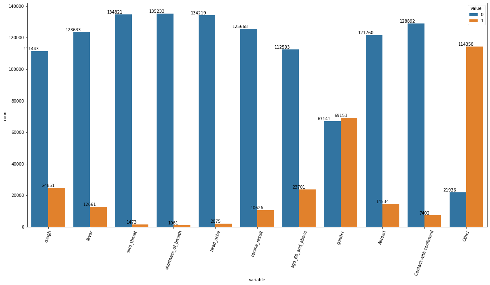

# Identifying COVID-19 Through Symptomatic Indicators

The goal of this project is to predict covid-19 from the symptoms observed in the patients during the Covid-19 test along with different factors of the individuals.

	1.To develop a model capable of predicting whether an individual is COVID-19 positive or negative based on their symptoms
	2.To minimize the instances where a positive case is incorrectly identified as negative, i.e. aiming for a false positive rate of less than 5%.
	3.Implementing a machine learning model that can accurately and reliably classify the data in the dataset in a timely manner.

	
## Dataset

The dataset used in this project **Covid-19_Data.csv** has 9 different features along with symptoms, date, age, and the test_indication.

## Environment
We used **Python 3.6** for this project and implemented the code in **Jupyter Notebook**

## Code

The code for this project is written in Python and uses the Keras library for building the machine learning model. The code is available in the `Covid-19_detection_VNK.ipynb` file.

## Data Visualisation
### Bar Plot

### Count Plot

### Correlation

## Results

Our model achieved an accuracy of 95% on the test set. The detailed results are presented below.
### Accuracy comparision after Hyperparameter Tuning

### Accuracy of different Models

### Execution Time for different models

## Conclusion

The objective of the research was to develop a machine learning algorithm capable of predicting COVID-19 with a reduced set of features and tests. Four classification techniques and nine essential features were employed in the study, and the results indicated that support vector machines and decision trees performed the most effectively.

## Contributors

	-Divya Mamuru
	-Likitha Vadla
	-Nikhith Krishna Vinduru
